# 26.09.2019 homework

During my homework I have done the following:
## Task 1

### 1. Installed ``httpd`` server
```sh
yum install httpd
```

### 2. Created test page ``/var/www/html/index.html``:
```sh
cat <<EOF >/var/www/html/index.html
<h2>Hello from httpd</h2>
<hr/>
<p>Created by Kiryl Rusetski</p>
EOF
```

### 3. Started ``httpd``, checked config syntax with ``httpd -S``, opened test page in browser:
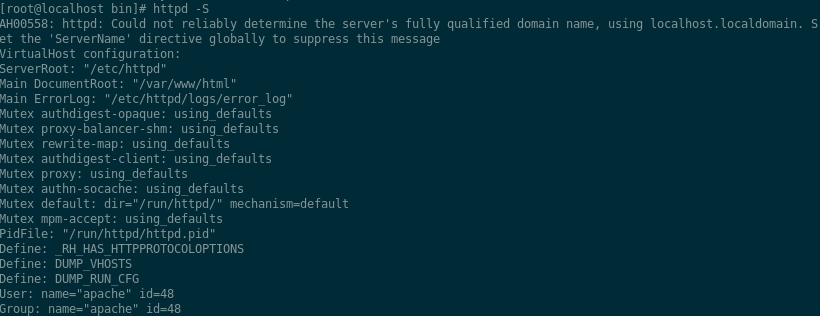
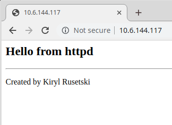

### 4. Installed apache2 from source
```sh
curl http://ftp.byfly.by/pub/apache.org//httpd/httpd-2.4.41.tar.gz | tar xz -C /opt
yum -y install centos-release-scl 
yum -y install devtoolset-6-gcc apr apr-devel apr-util apr-util-devel pcre-devel
. scl_source enable devtoolset-6
./configure --prefix=/opt/apache2
make -j4
make install
```

### 5. Created test html page ``/opt/apache2/htdocs/index.html``
```sh
cd /opt/apache2/htdocs/
cat <<EOF > index.html
<h2>Hello from Apache2</h2>
<hr />
<p>Created by Kiryl Rusetski</p>
EOF
```

### 6. Started apache2, checked config syntax with ``apachectl -S``, then opened a test page in browser

```sh
cd ../bin
./apachectl start
./apachectl -S
```
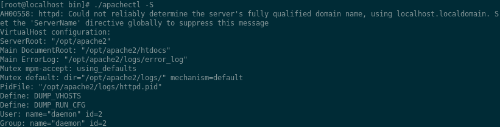
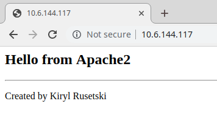

### What is apache graceful restart?
A graceful restart tells the web sever to finish any active connections before restarting. This means that active visitors to your site will be able to finish downloading anything already in progress before the server restarts.

## Task 2
### Configured test virtual host **kiryl.rusetski** with alias **www.kiryl.rusetski**
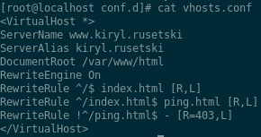
### Configured client machine so that it can resolve virtual host server name and alias
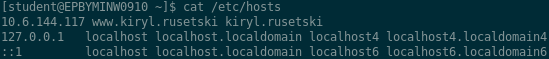
### Created test page named ping.html in virtual host root directory
```sh
cat <<EOF >ping.html
<h2>This is ping.html</h2>
<hr />
<p>Created by Kiryl Rusetski</p>
EOF
```
### Checked config file syntax
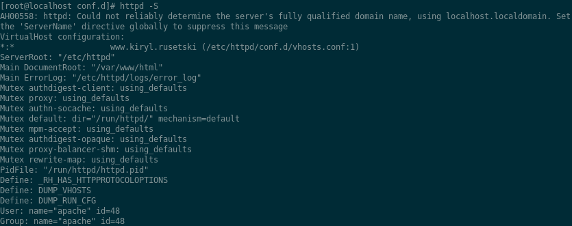
### Restarted web server and opened test page in browser
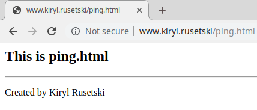
### Configured mod_rewrite for virtual host
Rules are the following:
- All root requests are redirected to **index.html** 
- All requests to **index.html** are redirected to **ping.html**
- All other requests are forbidden with HTTP Error 403


### Opened a debug console in browser and verified the configured redirects
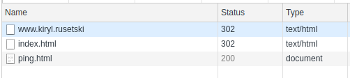

## Task 3
### Installed cronolog utility
```sh
yum -y install epel-release
yum -y install cronolog
```
### Modified vhosts' logging section to work with cronolog
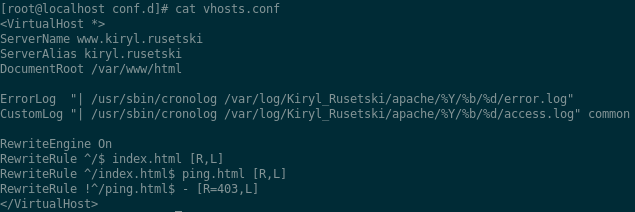

Log files are placed under the ``/var/log/Kiryl_Rusetski`` folder with subfolders indicating year, month and day when particular web server events were logged, as evidenced by the following two screenshots:

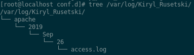
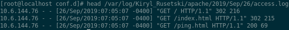

## Task 4
### Configured rsyslog service to log web server events
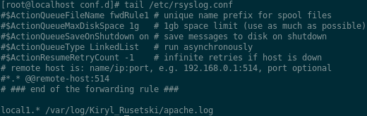

Last line of the above screenshot means that syslog facility **local1** is configured to write to the ``/var/log/Kiryl_Rusetski/apache.log`` file
### Configured the vhost to use the local1 facility of the rsyslog service
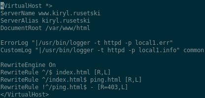

Error and access logs will therefore go to the ``/var/log/Kiryl_Rusetski/apache.log`` file
### Tested the config with curl
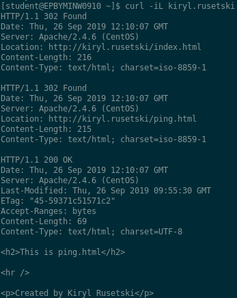

Access log entries:

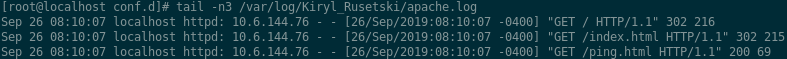

### Stopped httpd server to test error log redirection
```sh
systemctl stop httpd
```
Error log entries:

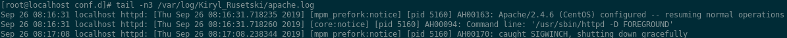

Above screenshot shows that server has caught a **SIGWINCH** signal and therefore shut itself down gracefully

